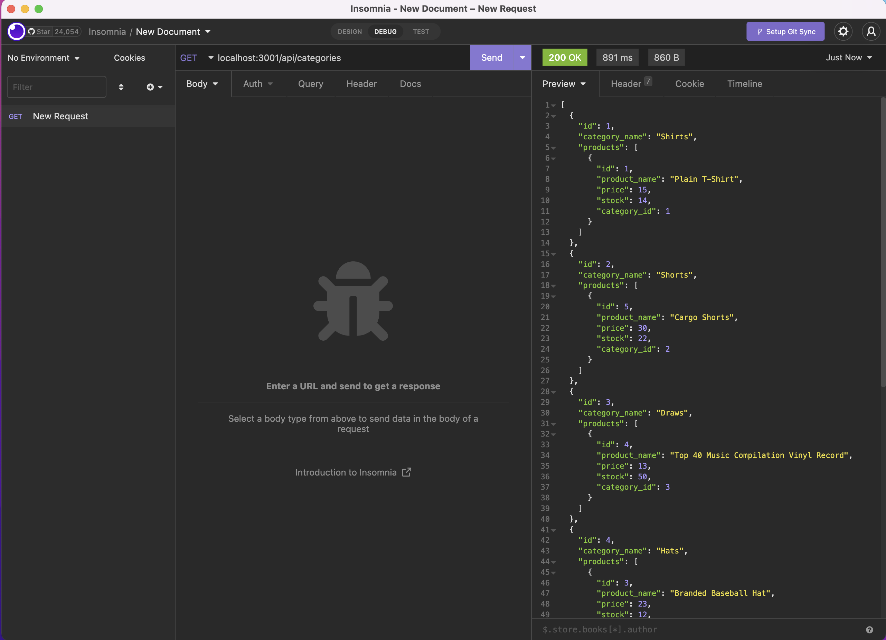
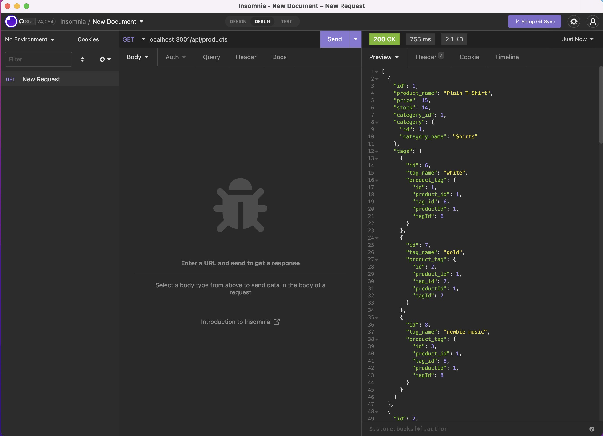
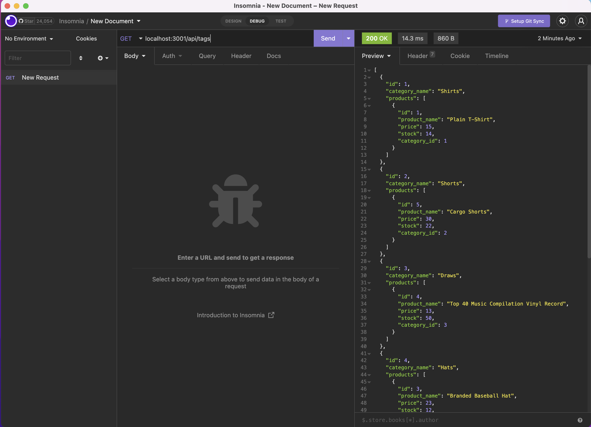

# E-Commerce RESTful API

## Table of Contents

This project is cusing the MIT license. 
    
- [Description](#description)
- [Installation](#installation)
- [Usage](#usage)
- [Credits](#credits)
- [License](#license)
- [Questions](#questions)

## Description
This project is a RESTful API that uses sequelize to simulate an E-Commerce back end. It can support Categories, Tags and Products. Tags are associated with products, and products are associated with categories. 


## Installation
Clone the repo locally on your machine and CD into it
Make sure you have node installed and an API tool such as Insomnia or Postman
run ``` npm i ``` to download all the dependencies associated with the project
run ``` mysql -u root -p ``` to securely log into sql. 
Once in SQL, run ``` source db/schema.sql ```
Close out of the terminal and open a new one, CDing back into appropriate directory
Create a .env file and add DB_NAME='ecommerce_db' and use sql credentials for DB_USER and DB_PASSWORD
run ``` npm run seed ``` to seed the db, then ``` npm start ``` to start the server. 

Open insomnia, and use 
``` localhost:3001/api ``` as the base url, appending /products, /categories or /tags to see information in JSON format


## Usage


Categories endpoint supports:
- Get all Categories
- Create a Category
- Get Category by ID
- Update Category by ID
- Delete Category by ID



Products endpoint supports:
- Get all Products
- Create a Product
- Get Product by ID
- Update Product by ID
- Delete Product by ID


Tags endpoint supports:
- Get all Tags
- Create a Tag
- Get Tag by ID
- Update Tag by ID
- Delete Tag by ID




## Credits
This project was part of the Georgia Tech Full Stack Coding Bootcamp.

## License
MIT 


## Questions

If you have additional questions, you can reach me here:

[Github Profile](https://github.com/lauraantunez024)

My Email: lauraantunez024@gmail.com

Link to deployed application or link to video to view:
https://www.loom.com/share/f140d5dd24c84cfeaebdf7eb658ef623


